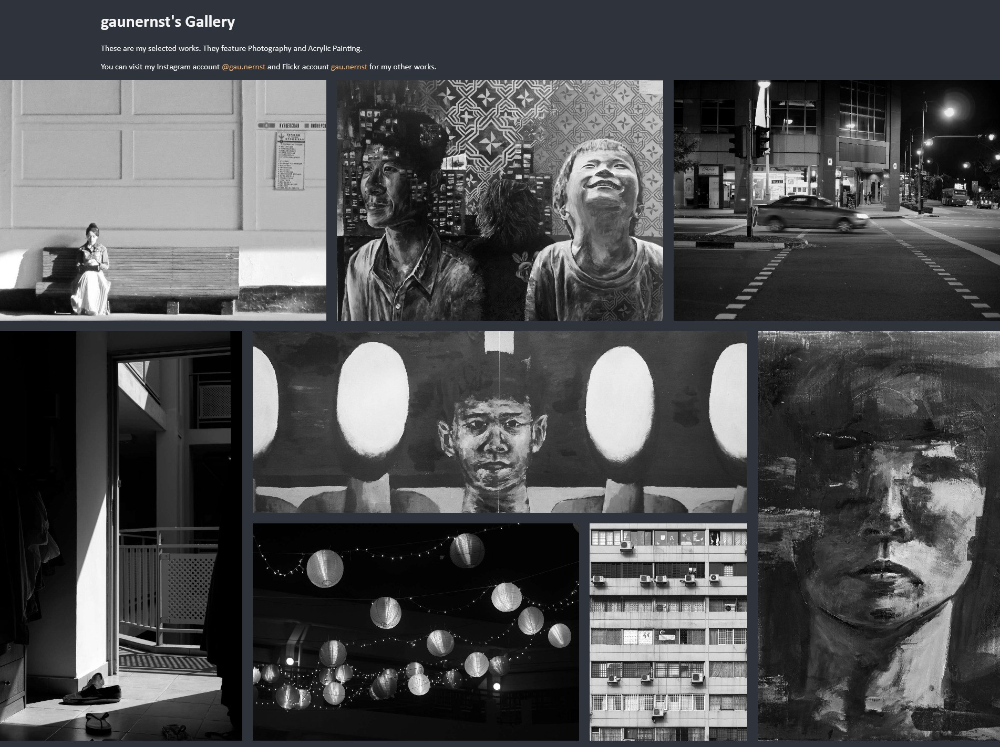
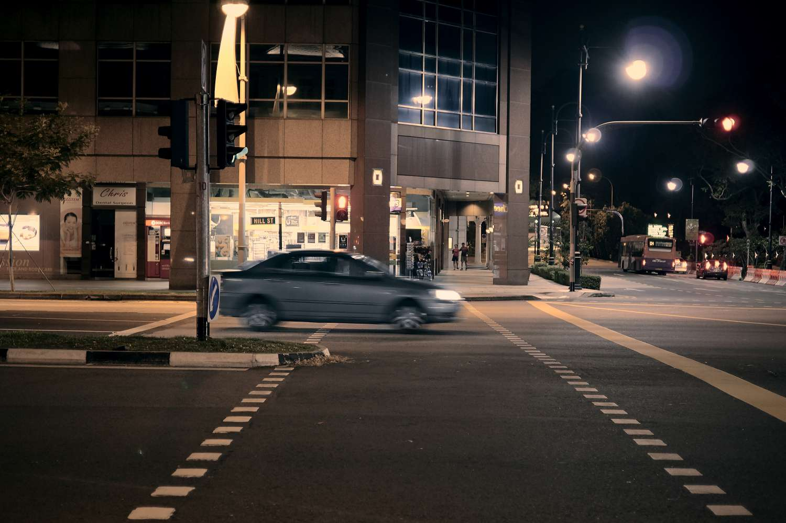
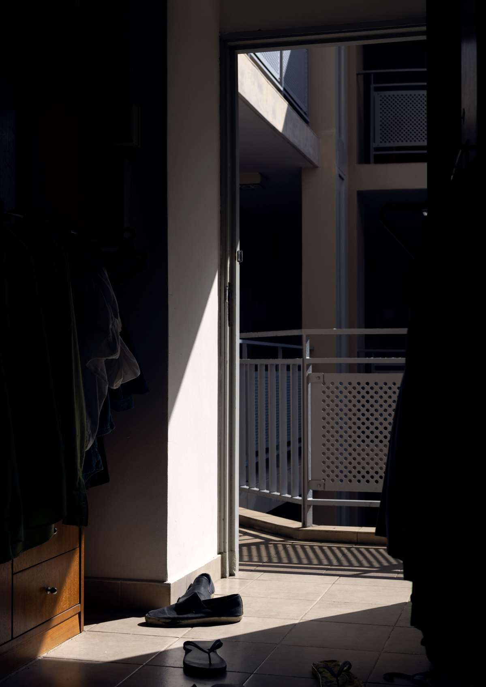
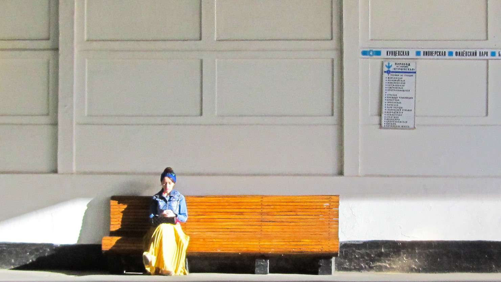
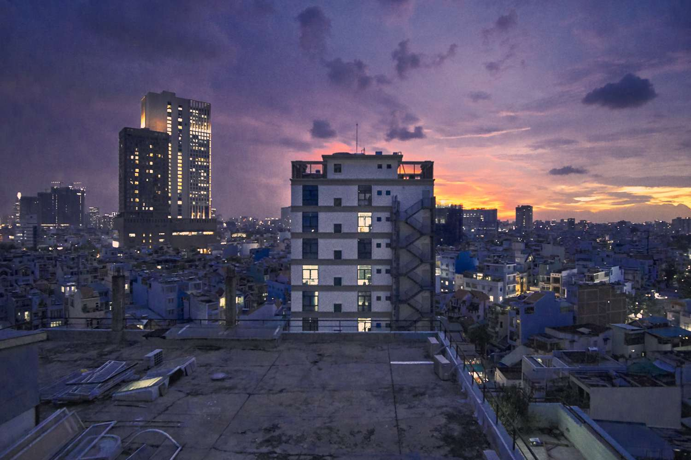
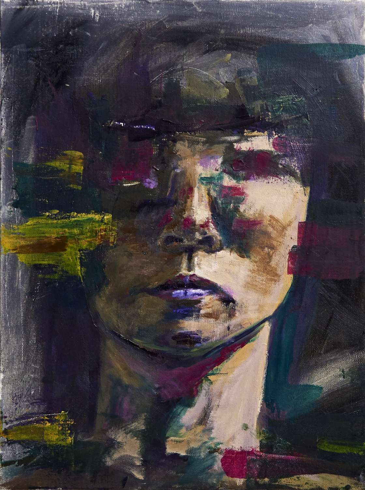

Gallery (https://gau-nernst.github.io/Gallery/)
=====================

This is my attempt at building a gallery website to showcase my works.

Lightbox is being developed. Meanwhile, you can check out my more frequently updated stuff on Instagram [@gau.nernst](https://www.instagram.com/gau.nernst/).

This site is built using only HTML, CSS and JavaScript.

# Layout

The layout is built using CSS Grid. Current implementation has many problems.

Displayed images are in black and white but turn color on hover.

On mobile devices, since on hover is not working, this effect is disabled.

# Photographs

All photographs are taken by me.

# Paintings

All paintings are done by me. My main medium is acrylic on canvas.

